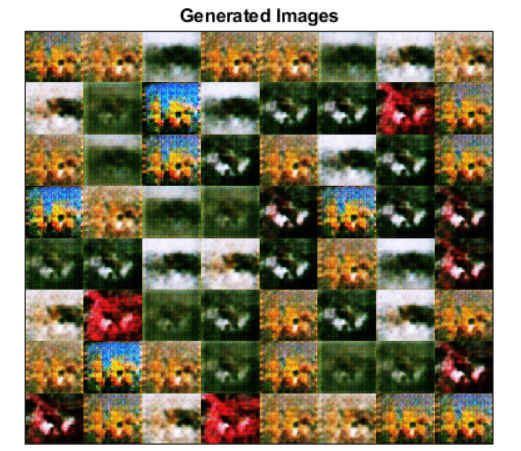
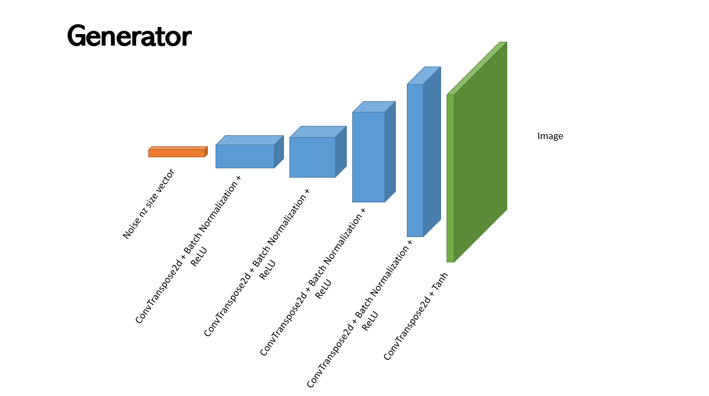
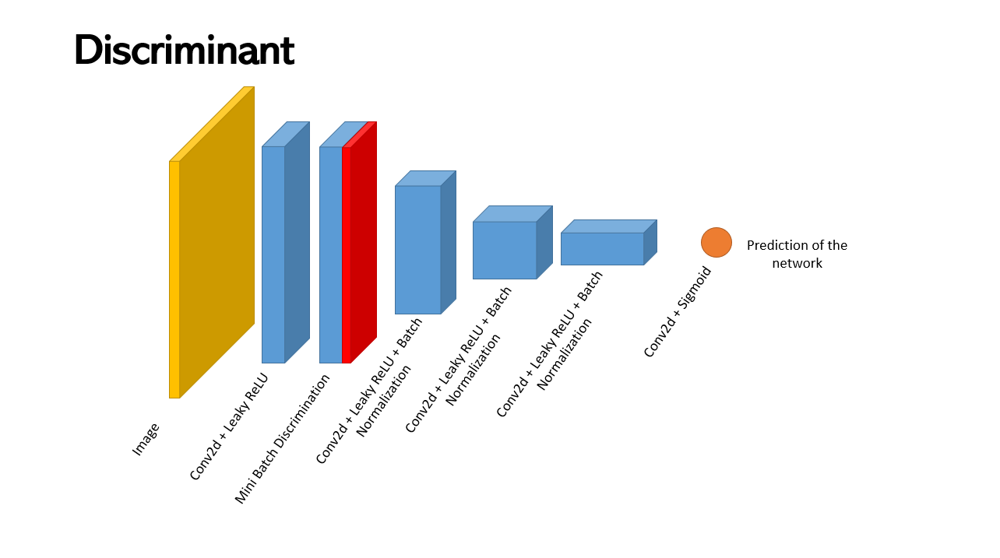
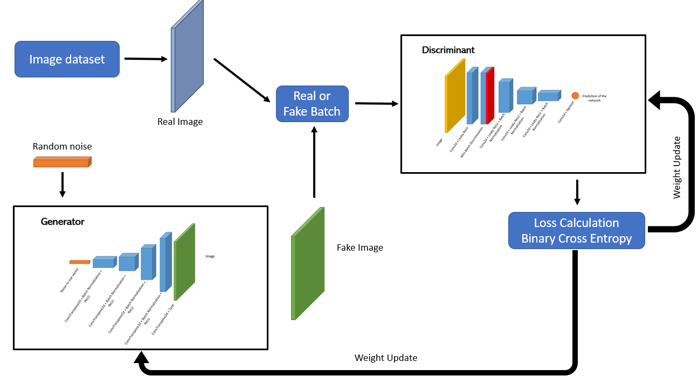
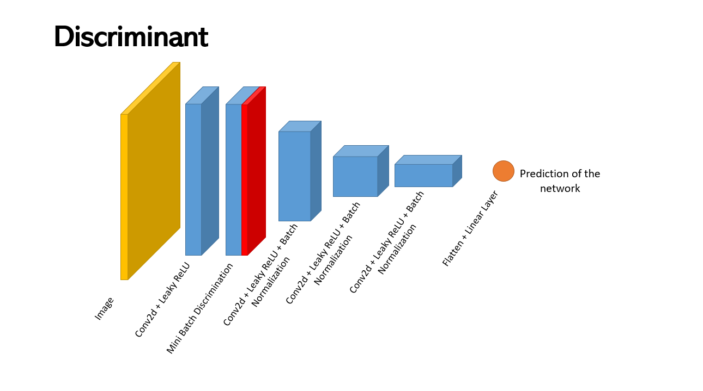
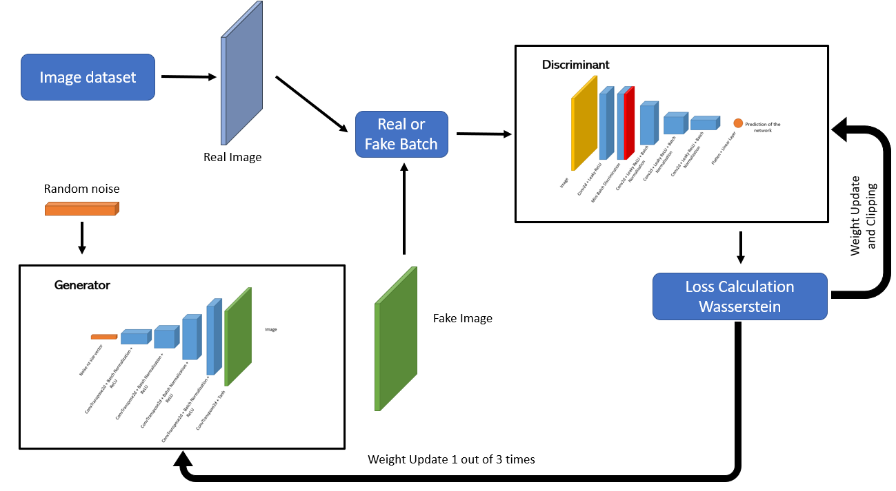
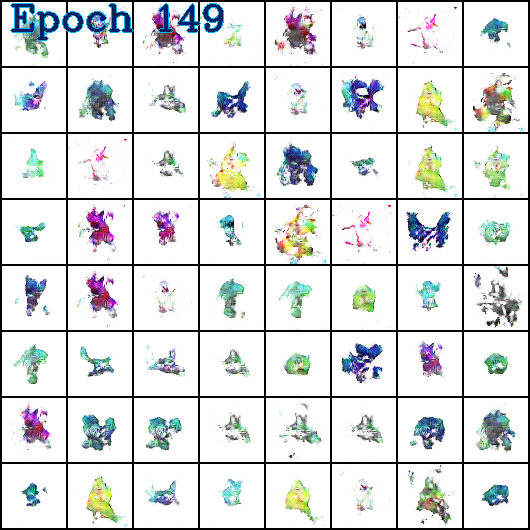
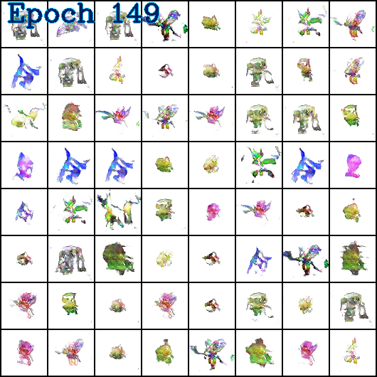
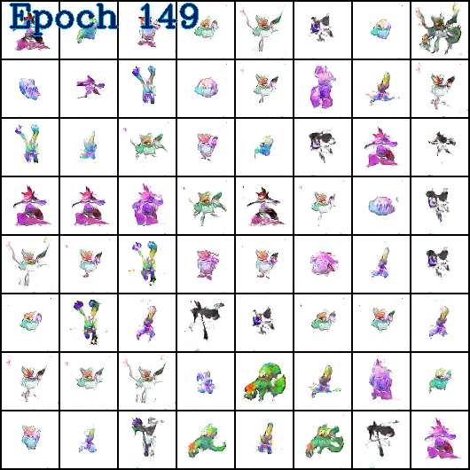
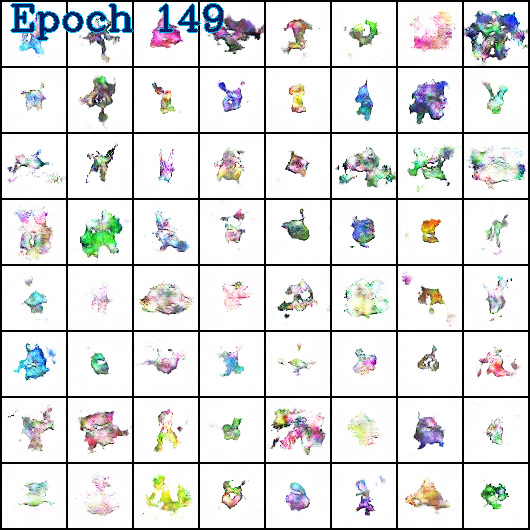

## Table Of Contents
* [Introduction](#introduction)
* [Datasets](#datasets)
* [Special GAN features](#special-gan-features)
  * [Mini Batch Discrimination](#mini-batch-discrimination)
  * [Label Smoothing](#label-smoothing)
  * [Noisy Label](#noisy-label)
* [DC-GAN](#dc-gan)
  * [DC-GAN Architecture](#dc-gan-architecture)
  * [Classic Training](#classic-training)
  * [Monitored Training](#monitored-training)
  * [Boost Training](#boost-training)
* [W-GAN](#w-gan)
  * [W-GAN Architecture](#w-gan-architecture)
  * [W-GAN Training](#w-gan-training)
* [Results](#results)
* [References](#references)

## Introduction

This project aims to develop multiple image Generative Adversarial Networks (GAN) using different datasets (64px and 256px images of pokemon), different models (DC-GAN and W-GAN will be used in this project), and different training processes. 

## Dataset

In this project I have used different datasets :
* A pokemon dataset (with data augmentation in 64px) that you can find <a href="https://drive.google.com/file/d/1mKWPRvdYg6jfN6G8AFxsHpzjo3608QaJ/view">here</a>.
* A pokemon dataset (with data augmentation in 256px) that you can find <a href="https://drive.google.com/file/d/19sQKN9H4gmNPxQLLtjDmw5SV5KZ4Q1n1/view">here</a>.

## Special Gan Features 

###  Mini Batch Discrimination

The following networks are mostly convolutional and deconvolutional networks. Yet it is known that GANs are based on complex equilibrium and that they can quickly become unstable and go into collapse mode :

  

In both DCGAN and WGAN models a Mini Batch Discrimination Layer is implemented in the Discriminant. This layer prevents the Generator to produce the same image for multiple inputs. For more informations see <a href="https://towardsdatascience.com/gan-ways-to-improve-gan-performance-acf37f9f59b">this link</a>.

### Label Smoothing

To avoid overconfidence for the Discriminant in the DCGAN model a BCE with label smoothing is used. See the custom function in <a href="./Trainings/basic_functions.py">basic_functions.py</a>.

### Noisy Labels

Once again to avoid overconfidence in the Discriminant, in one of the trainings of the DCGAN model, the labels are swapped between real images and fake, see in <a href="./Trainings/training_boosting.py">training_boosting.py</a>.

## DC-GAN 

### DC-GAN Architecture

A Deep Convolutional GAN (DC-GAN) is developed for (64px and 256px) using <a href="./Models/gan_64.py">gan_64.py</a> and <a href="./Models/gan_256.py">gan_256.py</a> with the mode "dcgan".
The architecture of the GAN is given by the following figures :

  

  

  

The generator input is an nz-sized vector (noise) that will be deconvoluted into an image.
The discriminant's input is an image and the output is a number $\in$ [0;1]. 1 means that the image is considered as being real and 0 means that it is considered as being fake.

### Classic Training

The first training used is a classic DC GAN training, defined in <a href="./Trainings/training_classic.py">training_classic.py</a>. The discriminant D is fed with real (x) and fake (G(z)) images of the generator G at each iteration and the loss is calculated with a Binary Cross Entropy loss function :

$$ D_{Loss}(x,z)= -(log(D(x)) + log(1-D(G(z))))$$

$$ G_{Loss}(z)= -(log(D(G(z))))$$

Then discriminant and generator are optimized to minimize these losses.
An Adam optimizer (lr=0.00015, beta1=0.5, beta2=0.999) has been used for both networks.

### Monitored Training
The second training used is a classic DC GAN training with a monitoring of the loss values that influences the training, defined in <a href="./Trainings/training_monitoring.py">training_monitoring.py</a>. The discriminant and generator loss are defined as for a classic training. A threshold is defined such as at each iteration the discriminant is optimized only if :

$$D_{Loss}>0.8*G_{Loss}$$

This is done to prevent the discriminant to become too powerful compared to the generator.
An Adam optimizer (lr=0.00015, beta1=0.5, beta2=0.999) has been used for both networks.

### Boost and Noisy Training
The third training used is a DC GAN training defined in <a href="./Trainings/training_boosting.py">training_boosting.py</a>. At each iteration, a random number k (uniform distribution) is computed and this number defines what will be trained during this iteration and how.

* if $0.0001 \lt k \lt 0.001$ for the next 100 iterations(including this one) ONLY the discriminant will be trained with real images labeled as real and fake images labeled as fake. This results in a boost in the training of the discriminant.
* if $0.001 \lt k \lt 0.93$ this iteration the discriminant will be trained with real images labeled as real and fake images labeled as fake.
* if $0.93 \le k \le 1$ this iteration the discriminant will be trained with real images labeled as fake and fake images labeled as real (Noisy Label) in order to add noise in the training for a more robust discriminant.
* if $0 \le k \lt 0.0001$ for the next 100 iteration(including this one) ONLY the generator will be trained. This results in a boost in the training of the generator.
* if $0.001 \lt k \le 1$ for this iteration the generator will be trained.

An Adam optimizer (lr=0.00015, beta1=0.5, beta2=0.999) has been used for both networks.

## W-GAN
### W-GAN Architecture

A Wasserstein GAN (W-GAN) is developed for (64px and 256px) using <a href="./Models/gan_64.py">gan_64.py</a> and <a href="./Models/gan_256.py">gan_256.py</a> with the mode "wgan".
The architecture of the GAN is given by the following figures :

  

  

  

The generator input is a nz-sized vector (noise) that will be deconvoluted into an image.
The discriminant's input is an image and the output is a number $\in \mathbb{R}$. This number is a score that assesses the realness of the image.

### W-GAN Training

The training is a Wasserstein GAN training defined in <a href="./Trainings/training_wgan.py">training_wgan.py</a>.
The discriminant D is fed with real (x) and fake (G(z)) images of the generator G at each iteration and the loss is calculated with a Binary Cross Entropy loss function :

$$ Distance_{D} = D_{Loss}(x,z) = (\sum_{i=1}^{batch size} D(x_{i}) - \sum_{j=1}^{batch size} D(G(z_{j})))$$

$$ Distance_{G} = G_{Loss}(z)= -(\sum_{i=1}^{batch size} D(G(z_{i})))$$

The goal of the discriminant is to maximize the distance $Distance_{D}$ between the distributions of the score given for real images and the distribution of the score given for fake images. In this project, we choose to minimize $-Distance_{D}$. The more the distribution will be separated the more the decision to assess if the image is real or fake is accurate.
The goal of the generator is to minimize the distance $Distance_{G}$ between the distributions of the score given for real images and the distribution of the score given for fake images. The generator tries to fool the discriminant with generated images that should be classified as real, it is reducing the distance between the distributions.
During this training, we apply weights clipping on the discriminant's weights and the discriminant is trained 3 times more than the generator.

An RMSProp optimizer (lr=5e-5) has been used for both networks for stability reasons.

For more informations on WGAN training check <a href="https://machinelearningmastery.com/how-to-implement-wasserstein-loss-for-generative-adversarial-networks/">this website</a>.

## Results

Here are some results of the networks :

### DC-GAN classic

  

  

### DC-GAN monitoring

  

  

### DC-GAN boosting and noisy label

  

  

### W-GAN

  

  

## Conclusion

Once trained, the 64px networks produce images with sharp edges like small terrifying monsters.

Moreover the Mini Bacth Discrimination layer seems to perform well : even images that looks close have some variations (same type of pokemon but still a bit different). Even with a small latent space the networks always produce different outputs.

An improvement of these 64px networks is planned in the future.

For now, I have trained the 256px networks and obtained good results (images with sharp edges). Yet I believe that I need to tune the hyperparameters to get better results. These networks takes a lot of time to train so I will update this project as soon as I will have the time to compute good results !
